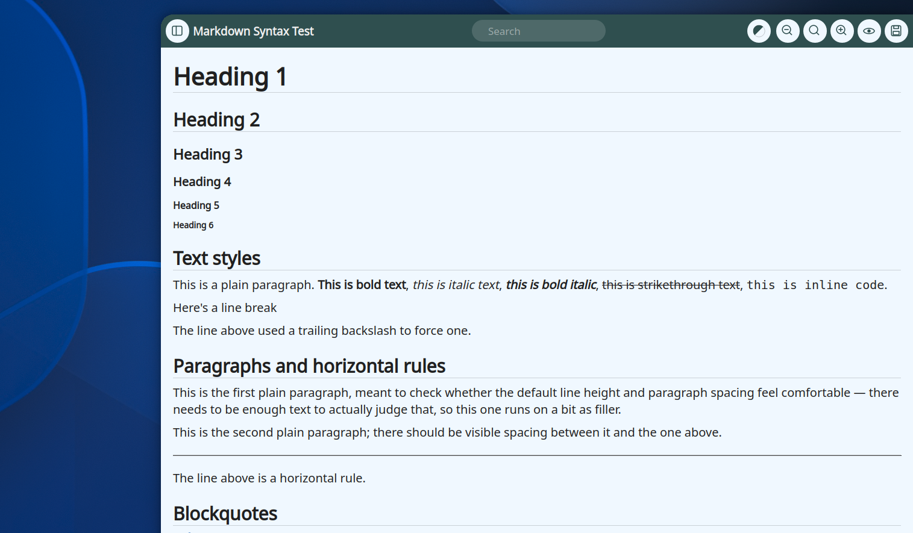
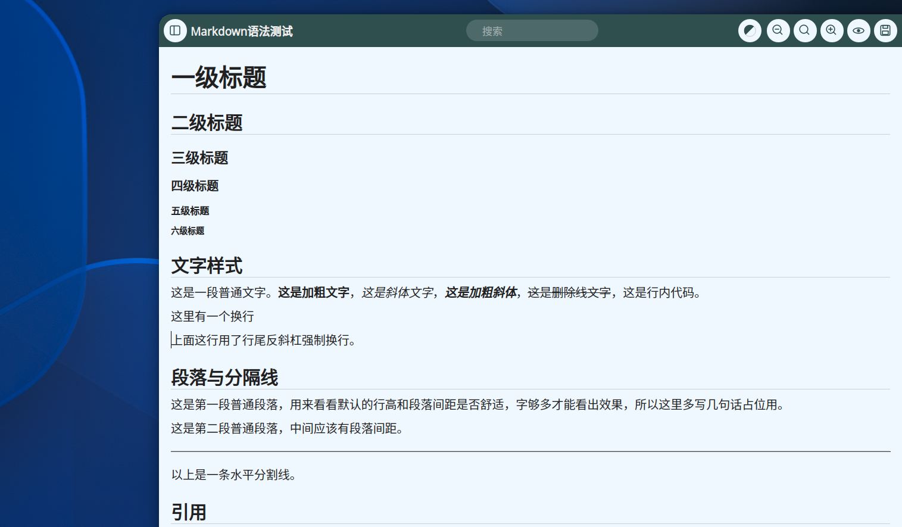

# mdnote

<p align="center"><a href="#english">English</a> · <a href="#简体中文">简体中文</a></p>

---

## English

A Yakuake-style, slide-out Markdown notebook for Linux. Press F10, jot something down, press F10 again — it's gone. Notes are plain `.md` files on disk; there's no database and no proprietary format.



### Features

- **Global F10 toggle** — slides in from the right edge, slides back out. Native `KGlobalAccel` binding on KDE Plasma; a companion GNOME Shell extension provides the same toggle under GNOME/Wayland, where ordinary clients can't register global shortcuts or force their own window placement. Experimental Windows support (see [Windows](#windows-experimental)) uses `RegisterHotKey` instead.
- **Two editing modes** — source mode (plain Markdown text, syntax-highlighted) and normal mode (WYSIWYG rich text), switchable at any time. Saving always writes plain Markdown, via a serializer that walks the document directly to GFM Markdown — no external converter, no HTML intermediate.
- **Live theme switching** — nine built-in color presets plus the system default, applied instantly across the whole window.
- **Directory-based sidebar** — browse a folder of notes by all/recent/starred, with search, rename, and delete.
- **Multi-language UI** — English, Simplified Chinese, and Traditional Chinese, switched automatically by the system locale (see [Localization](#localization)).

### Dependencies

Package names confirmed on Debian testing:

```bash
sudo apt install build-essential cmake qt6-base-dev qt6-tools-dev \
  libkf6config-dev libkf6windowsystem-dev libkf6globalaccel-dev \
  libkf6coreaddons-dev libkf6dbusaddons-dev liblayershellqtinterface-dev
```

`qt6-wayland` is recommended at runtime on Wayland sessions.

### Build & install

Two ways to install: build from source into your own home directory (no root needed), or build a Debian package (installs system-wide). Either way ends up with a working `mdnote` binary and `.desktop` entry — just at different paths.

**From source, into `~/.local`** (make sure `~/.local/bin` is on your `PATH`):

```bash
cmake -B build
cmake --build build -j$(nproc)
cmake --install build --prefix ~/.local
```

This installs the binary to `~/.local/bin/mdnote` and the desktop entry to `~/.local/share/applications/org.kde.mdnote.desktop`. Run `kbuildsycoca6` afterward so KDE picks up the newly installed entry.

**As a Debian package** (installs to `/usr/bin/mdnote` and `/usr/share/applications/` instead):

```bash
sudo apt install debhelper cmake qt6-base-dev qt6-tools-dev \
  libkf6config-dev libkf6windowsystem-dev libkf6globalaccel-dev \
  libkf6coreaddons-dev libkf6dbusaddons-dev liblayershellqtinterface-dev \
  libglib2.0-bin
dpkg-buildpackage -us -uc -b
sudo apt install ../mdnote_*.deb ../gnome-shell-extension-mdnote-quake_*.deb
```

The rest of this README uses the from-source `~/.local` paths — substitute `/usr` for `~/.local` throughout if you installed via the `.deb`.

### Windows (experimental)

Basic Windows support was added recently (global hotkey via `RegisterHotKey`, settings via `QSettings`, single-instance via `QLocalSocket`/`QLocalServer`, always-on-top via `SetWindowPos`) and has been built and run successfully on Windows 10/11. One known rough edge: the same pixel-mask technique Linux uses for the rounded corners has no antialiasing, so at 100% display scaling the curve looks a bit more faceted than on a higher-DPI or scaled-up display (a native-compositor-rounding alternative was tried and reverted -- it rounded the wrong rectangle, see the git history if curious). [Bug reports / PRs](https://github.com/potatofamilyli1979/mdnote/issues) welcome.

Prerequisites: Qt6 (MSVC or MinGW kit, including the Linguist Tools component — installable via the [Qt online installer](https://www.qt.io/download-qt-installer)) and CMake.

```powershell
cmake -B build -DCMAKE_PREFIX_PATH="C:\Qt\6.8.0\mingw_64"
cmake --build build --config Release
```

(Substitute your actual Qt install path/kit; add `-G "MinGW Makefiles"` for a MinGW kit, or run from a "x64 Native Tools Command Prompt for VS" for an MSVC kit.)

The build won't run as-is: Qt's DLLs aren't on Windows' default search path, so run Qt's deployment tool against the built executable once, from the matching kit's `bin` directory:

```powershell
C:\Qt\6.8.0\mingw_64\bin\windeployqt6.exe build\mdnote.exe
```

The GNOME Shell extension and Debian packaging obviously don't apply here — this builds just the `mdnote.exe` editor/notebook itself. There's no Windows installer yet; run the deployed executable directly, or copy the whole output folder wherever you like.

### Autostart (recommended)

mdnote is meant to sit in the background waiting for F10, not be launched by hand each time — enabling it at login is the intended way to run it:

```bash
mkdir -p ~/.config/autostart
cp ~/.local/share/applications/org.kde.mdnote.desktop ~/.config/autostart/   # or /usr/share/applications/ if installed via .deb
echo "X-GNOME-Autostart-enabled=true" >> ~/.config/autostart/org.kde.mdnote.desktop
```

### Running

`mdnote` starts with no visible window, waiting for F10. On first run it registers the shortcut with `KGlobalAccel`; you can see it under Plasma's System Settings → Shortcuts → mdnote. Under GNOME, install the `gnome-shell-extension-mdnote-quake` package and enable it (`gnome-extensions enable mdnote-quake@localhost`, then log out and back in) for the same F10 toggle.

Single-instance behavior is handled by KDE Frameworks' `KDBusService`, which also registers `org.kde.mdnote` on the session bus.

### Localization

The UI's source language is English; Simplified and Traditional Chinese translations are bundled and selected automatically from the system locale (Simplified for `zh_Hans`/`zh_CN`/`zh_SG`-style locales, Traditional for `zh_Hant`/`zh_TW`/`zh_HK`), falling back to English for anything else. To force a specific language regardless of the system locale:

```bash
LANGUAGE=en_US LC_ALL=C mdnote      # force English
LANGUAGE=zh_CN LC_ALL=zh_CN.UTF-8 mdnote   # force Simplified Chinese
LANGUAGE=zh_TW LC_ALL=zh_TW.UTF-8 mdnote   # force Traditional Chinese
```

Translation sources live in `translations/*.ts` (Qt Linguist format); after adding or changing any UI string, run the `update_translations` CMake target to resync them:

```bash
cmake --build build --target update_translations
```

### Rich-text commands (normal mode)

Formatting commands live in the right-click context menu while in normal mode (the toolbar itself only has sidebar toggle / search / theme / zoom / mode-switch / save) — right-click gives you Bold/Italic/etc., a Paragraph submenu (headings, promote/demote), and an Insert submenu (image, table, code block, horizontal rule).

Implemented: headings 1–6, paragraph, promote/demote heading, blockquote, ordered/unordered lists, horizontal rule, code blocks, tables, bold/italic/underline/strikethrough/inline code, links, clear formatting.

Of the shortcuts shown in the menus, only Bold/Italic/Underline are currently wired to real key bindings (native `QTextEdit` behavior) — the rest are menu-only for now.

Not implemented (Qt's plain rich-text framework doesn't support these natively, or they'd need a dedicated rendering engine): interactive task-list checkboxes, LaTeX math blocks, admonition/callout boxes, footnotes, auto-generated table of contents, YAML front matter, comment syntax.

### Images & links (normal mode)

- Remote images (``) load asynchronously, showing a placeholder box until they're ready. Local file paths resolve immediately via Qt's own resource loading.
- A plain click on a link moves the cursor into it (so you can edit the link text); **Ctrl+click** opens it in your default browser. Hovering while holding Ctrl shows a hand cursor and the link's target.

### Known limitations

- **No slide animation under Wayland** — KWin/mutter don't let a client freely move its own top-level window, so the window is pinned to the screen edge via `LayerShellQt` instead, and show/hide is an instant toggle rather than an animated transition. X11 sessions get a real position-slide animation.
- Opening a file uses Qt's own `QTextDocument::setMarkdown()`, which doesn't cover 100% of GFM (some extended syntax may not round-trip) — fine for everyday notes, but not a full CommonMark/GFM implementation.
- No dedicated settings UI yet beyond the theme picker — width ratio, default folder, and a few other options are config-file only (see below).

### Config file

`~/.config/mdnoterc`:

```ini
[General]
widthRatio=0.5
animationDurationMs=220
hideOnFocusLost=false
lastMode=normal
themeKey=

[Folders]
defaultFolder=/home/you/Documents/Notes
recentFolders=...

[Sidebar]
open=false
sortKey=mtime
sortAscending=false
```

### License

GPL-3.0-or-later — see [LICENSE](LICENSE). The GNOME Shell extension (`gnome-extension/quake-mode.js`) is adapted from [Quake Terminal](https://github.com/diegodario88/quake-terminal), used under the same license.

---

## 简体中文

Yakuake 风格、从右侧滑出的 Markdown 速记本。按 F10 呼出，随手记点东西，再按一下 F10 收起。笔记就是硬盘上普通的 `.md` 文件，没有数据库，没有私有格式。



### 功能

- **全局 F10 呼出/收起** — 从屏幕右侧滑入滑出。KDE Plasma 下用原生 `KGlobalAccel` 绑定；GNOME/Wayland 下普通客户端既不能注册全局快捷键，也不能强制自己的窗口位置，所以配了一个同名的 GNOME Shell 扩展来实现同样的 F10 呼出。实验性的 Windows 支持（见[Windows](#windows实验性)）用的是 `RegisterHotKey`。
- **源码/正常两种编辑模式** — 源码模式是带语法高亮的纯 Markdown 文本，正常模式是所见即所得的富文本，随时可以切换。保存时始终写出纯 Markdown，直接遍历文档结构序列化成 GFM Markdown，不依赖任何外部转换工具，也没有 HTML 中间环节。
- **实时主题切换** — 内置九套配色加系统默认，切换即时应用到整个窗口。
- **按目录浏览的侧边栏** — 全部/最近/收藏三个视图，支持搜索、重命名、删除。
- **多语言界面** — 英文、简体中文、繁体中文，跟随系统语言自动切换（见下方[多语言](#多语言)）。

### 依赖

Debian testing 上确认可用的包名：

```bash
sudo apt install build-essential cmake qt6-base-dev qt6-tools-dev \
  libkf6config-dev libkf6windowsystem-dev libkf6globalaccel-dev \
  libkf6coreaddons-dev libkf6dbusaddons-dev liblayershellqtinterface-dev
```

Wayland 会话下运行时建议装上 `qt6-wayland`。

### 构建 & 安装

两种装法：从源码编译装到自己的家目录（不需要 root），或者打成 Debian 包装到系统目录。两种最后都会有一个能跑的 `mdnote` 二进制和 `.desktop` 文件，只是路径不一样。

**从源码装到 `~/.local`**（记得把 `~/.local/bin` 加进 `PATH`）：

```bash
cmake -B build
cmake --build build -j$(nproc)
cmake --install build --prefix ~/.local
```

这样二进制在 `~/.local/bin/mdnote`，desktop 文件在 `~/.local/share/applications/org.kde.mdnote.desktop`。装完跑一下 `kbuildsycoca6`，让 KDE 识别新装的 desktop 文件。

**打 Debian 包**（装到 `/usr/bin/mdnote` 和 `/usr/share/applications/`，不是 `~/.local`）：

```bash
sudo apt install debhelper cmake qt6-base-dev qt6-tools-dev \
  libkf6config-dev libkf6windowsystem-dev libkf6globalaccel-dev \
  libkf6coreaddons-dev libkf6dbusaddons-dev liblayershellqtinterface-dev \
  libglib2.0-bin
dpkg-buildpackage -us -uc -b
sudo apt install ../mdnote_*.deb ../gnome-shell-extension-mdnote-quake_*.deb
```

下面文档里统一用源码安装的 `~/.local` 路径举例，如果你是装的 `.deb`，把 `~/.local` 换成 `/usr` 就对了。

### Windows（实验性）

最近刚加上了基础的 Windows 支持（全局快捷键用 `RegisterHotKey`，配置存储用 `QSettings`，单实例用 `QLocalSocket`/`QLocalServer`，置顶用 `SetWindowPos`），已经在 Windows 10/11 上编译运行成功。已知的一个小瑕疵：圆角用的是跟 Linux 一样的像素遮罩方案，不支持抗锯齿，在 100% 缩放下看起来会比高分屏/缩放屏上更有棱角一些（中间试过换成系统原生圆角渲染，但遮罩加在了错的矩形上，效果更差，已经改回来了，感兴趣可以翻 git 记录）。欢迎提 [bug 或 PR](https://github.com/potatofamilyli1979/mdnote/issues)。

依赖：Qt6（MSVC 或 MinGW 套件，记得勾上 Linguist Tools 组件——可以从 [Qt 官方在线安装器](https://www.qt.io/download-qt-installer) 装）和 CMake。

```powershell
cmake -B build -DCMAKE_PREFIX_PATH="C:\Qt\6.8.0\mingw_64"
cmake --build build --config Release
```

（路径换成你实际的 Qt 安装位置/套件；MinGW 套件加 `-G "MinGW Makefiles"`，MSVC 套件要在 "x64 Native Tools Command Prompt for VS" 里跑。）

编译完不能直接运行：Qt 的 DLL 不在 Windows 默认搜索路径里，需要用对应套件 `bin` 目录下的部署工具跑一次：

```powershell
C:\Qt\6.8.0\mingw_64\bin\windeployqt6.exe build\mdnote.exe
```

GNOME Shell 扩展和 Debian 打包这两块在 Windows 上自然用不上——这只是编译出编辑器/笔记本本体的 `mdnote.exe`。暂时没有 Windows 安装包，部署好之后可执行文件直接运行，或者把整个输出文件夹拷到任意地方都行。

### 开机自启（推荐）

mdnote 是常驻后台等 F10 的模式，不是"要用了再手动开"的程序，建议做成开机自启，登录后就一直在后台待命：

```bash
mkdir -p ~/.config/autostart
cp ~/.local/share/applications/org.kde.mdnote.desktop ~/.config/autostart/   # 装的 .deb 就用 /usr/share/applications/ 下的那份
echo "X-GNOME-Autostart-enabled=true" >> ~/.config/autostart/org.kde.mdnote.desktop
```

### 运行

`mdnote` 启动后不会显示窗口，在后台等 F10。第一次运行会向 `KGlobalAccel` 注册好快捷键，「系统设置→快捷键→mdnote」能看到。GNOME 下需要额外装 `gnome-shell-extension-mdnote-quake` 包并启用（`gnome-extensions enable mdnote-quake@localhost`，然后重新登录一次）才有同样的 F10 呼出。

单实例逻辑由 KDE Frameworks 的 `KDBusService` 负责，同时会在会话总线上注册 `org.kde.mdnote` 这个 D-Bus 服务名。

### 多语言

界面的源语言是英文，简体中文和繁体中文翻译内置在程序里，根据系统语言自动选择（`zh_Hans`/`zh_CN`/`zh_SG` 一类走简体，`zh_Hant`/`zh_TW`/`zh_HK` 一类走繁体），其他语言一律回落到英文。想在不改系统语言的情况下强制指定语言：

```bash
LANGUAGE=en_US LC_ALL=C mdnote             # 强制英文
LANGUAGE=zh_CN LC_ALL=zh_CN.UTF-8 mdnote   # 强制简体中文
LANGUAGE=zh_TW LC_ALL=zh_TW.UTF-8 mdnote   # 强制繁体中文
```

翻译源文件在 `translations/*.ts`（Qt Linguist 格式），改动或新增界面文字后跑一下 `update_translations` 这个 CMake target 重新同步：

```bash
cmake --build build --target update_translations
```

### 正常模式的富文本命令

正常模式下，格式相关的命令都在右键菜单里（工具栏本身只有侧栏开关/搜索/主题/缩放/模式切换/保存这几个按钮）——右键能看到加粗/斜体等格式项、"段落"子菜单（标题、提升/降低标题级别）、"插入"子菜单（图像、表格、代码块、水平分割线）。

已实现：一~六级标题、段落、提升/降低标题级别、引用、有序/无序列表、水平分割线、代码块、表格、加粗/斜体/下划线/删除线/行内代码、超链接、清除样式。

菜单里显示的快捷键中，目前只有加粗/斜体/下划线是真的能按键触发的（`QTextEdit` 自带行为），其余的暂时只能点菜单触发。

没做的（Qt 原生富文本框架不支持，或者需要额外渲染引擎）：任务列表勾选框交互、LaTeX 公式块、警告框、脚注、自动生成目录、YAML Front Matter、注释语法。

### 图片与链接（正常模式）

- 网络图片（``）异步加载，加载完成前是个占位框；本地文件路径的图片走 Qt 自带的资源解析，立即显示。
- 单击链接是把光标移进去，方便编辑链接文字；**按住 Ctrl 点击**才会用默认浏览器打开。鼠标悬停时按住 Ctrl 会看到指针变成手型并显示链接地址。

### 已知限制

- **Wayland 下没有滑动动画** — KWin/mutter 不允许客户端自由移动自己的顶层窗口，所以用 `LayerShellQt` 把窗口锚定在屏幕边缘，呼出/收起是直接显示/隐藏，没有过渡动画。X11 会话下是真正的位移滑动动画。
- 打开文件用的是 Qt 自带的 `QTextDocument::setMarkdown()`，没有 100% 覆盖 GFM 扩展语法，日常笔记场景够用，但不是完整的 CommonMark/GFM 实现。
- 除了主题选择，暂时没有独立的设置界面 — 窗口宽度比例、默认文件夹等选项目前只能改配置文件（见下）。

### 配置文件

`~/.config/mdnoterc`：

```ini
[General]
widthRatio=0.5
animationDurationMs=220
hideOnFocusLost=false
lastMode=normal
themeKey=

[Folders]
defaultFolder=/home/you/Documents/Notes
recentFolders=...

[Sidebar]
open=false
sortKey=mtime
sortAscending=false
```

### 许可证

GPL-3.0-or-later，见 [LICENSE](LICENSE)。GNOME Shell 扩展部分（`gnome-extension/quake-mode.js`）改写自 [Quake Terminal](https://github.com/diegodario88/quake-terminal)，沿用同一许可证。
